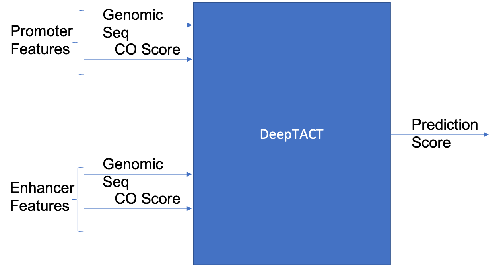

# Introduction

Preprocess/generate input features and training labels for DeepTact. 

To run:  
	`sbatch run_deeptact_prep.sh <resume-session-id>`    
The session-id can be found with `nextflow log`. 

**NOTE** : Files store in code/storeDir are used for promoter and enhancer lists.

# Input Parameters and Files

The input file paths are specified in the nextflow config file parameters.
The input .bam files for DNase/ATAC-seq input are specified separately in a .csv specified in *params.coScore_data*

Input Files for DeepTACT Features :
	- Promoter/Enhancer Lists, to filter PCHi-C data : params.promoter_bedfile, params.enhancer_bedfile
	- fasta files, to Extract Genomic Sequence : params.species_genome_fasta
	- DNase-Seq bam files, to generate COScore (Chromatin Openness Score) for each element in the promoter/enhancer list  : inside file params.coScore_data

Input Files for DeepTACT Ground Truth data :
	- PCHi-C data : params.hic_input
	- gtf file, to select promoters transcripts corresponding to genes : params.gtf_transcript_to_gene

# Preprocessing Steps

Note : Modules storeDir directive storess the channel 

1. Preprocess regulatory element lists :
	* PREPROCESS_PROMOTER
	* PREPROCESS_ENHANCER
2. Construct chromatin openness score (CO score) profiles for input reg elements (from step 1):
	1. Generate .bam.bai index files for ATAC/DNase input bam files: GEN_BAM_INDEX
	2. Construct CO score from .bam files: CHROM_OPENN_SCORE
	3. Normalize CO score and output CO score for reg elements:
		* CHROM_OPENN_SCORE_PROFILE_ENHANCER
		* CHROM_OPENN_SCORE_PROFILE_PROMOTER

3. Generate genomic sequence for reg element lists from fasta files:
	* GENOMIC_SEQUENCE_PROMOTER
	* GENOMIC_SEQUENCE_ENHANCER
4. Training Label Preparation
	1. split hic input for faster preprocessing into **params.hic_split_process** parts: SPLIT_HIC
	2. match hic input pairs to reg elements from step 1: MATCH_HIC_TO_REG_ELEMENTS
	3. combine matched files: COMBINE_MATCHED_HIC
	4. combine promoters which correspond to the same gene i.e. in the promoter list there are a lot of promoters that are essentially the same; combine them: COMBINE_PROMOTERS
	5. generate interactions for negative training data: GEN_NEG_LABEL
	6. augment training data by a factor of *params.hic_augment_factor* and output training .csv file: GEN_AUGMENTED_LABEL 
5. Combine steps 1,2,3, and 4 ie. generate features for reg elemetns from step 5:
	0. split hic augmented file into **params.hic_split_combine** parts: SPLIT_HIC_AUG
	1. combine CO score profile data :
		1. COMBINE_PCHIC_CO_SCORE
		2. COMBINE_PCHIC_CO_SCORE_ENH, COMBINE_PCHIC_CO_SCORE_PR
		3. COMBINE_CO_SCORE_REPS
	2. combine DNA-seq data :
		1. COMBINE_PCHIC_DNA_SEQ
		2. COMBINE_PCHIC_OUT_ENHANCER, COMBINE_PCHIC_DNA_SEQ_PROMOTER
	3. combine all the features into one file and break up by data points.
		1. SAVE_ENH_DNA_SEQ, SAVE_PR_DNA_SEQ, SAVE_ENH_CO_SCORE, SAVE_PR_CO_SCORE
		2. SEPARATE_DATA

# Parameters

Preprocessing regulatory elements requires the following input parameters :

- [input] **promoter_bedfile**, **enhancer_bedfile** : regulatory element list
- **bgWindow** : background window size for regulatory elements for normalization of CO score
- **promoter_window**, **promoter_window** : length of genomic window for regulatory elements
- **augment_length** : additional window length added to regulatory elements for data augmentation step
- **augment_step** : step size for data augmentation
- **promoter_headers**, **enhancer_headers** : headers of input bed files

Preprocessing genomic sequence features :
- [input] **species_genome_fasta** : input fasta file for human
- **chromList** : chromosome name list for human
- **chromLen_GRCh37v13** : chromosome lengths

Preprocessing PCHi-C input for training data :
- [input] **hic_input** : input hic interactions
- **pos_threshold** : threshold for considering an interaction a positive interaction ( val > threshold -> positive interaction )
- **neg_threshold** : threshold for considering an interaction a negative interaction ( val < threshold -> negative interaction )
- **gtf_transcript_to_gene** : 
- **pos_neg_interac_ratio** : number of negative interactions to generate per positive interaction
- **hic_augment_factor** : augment all itneractins, multiplicative factor value
- **cellTypes** : all the cell types to process for the hic data above

Preprocessing chromatin openness feature : 
- [input] **coScore_data** : .bam files for ATAC/DNase seq data

# ATAC-seq data

Out of the 6 cell types that we considered for DNase-seq data : 
- naive CD4+ T Cells
- monocytes
- total B cells
- total CD4+ T cells 
- total CD8+ T cells
- fetal thymus cells

Only B cell and total T cell data was found on Encode & 4D nucleome: 
- https://www.encodeproject.org/matrix/?type=Experiment&assay_title=ATAC-seq&biosample_ontology.cell_slims=T+cell
- https://www.encodeproject.org/matrix/?type=Experiment&assay_title=ATAC-seq&biosample_ontology.cell_slims=B+cell

