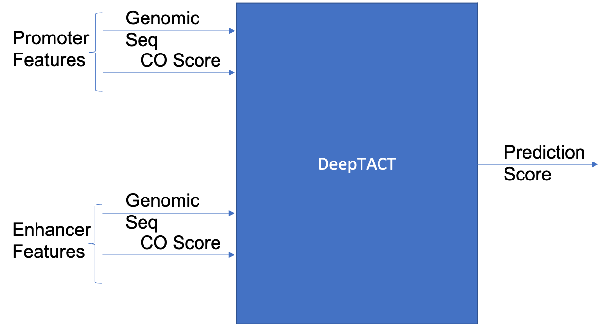

# Code Organization 

Nextflow Pipeline for input feature generation for DeepTACT.

base folder : /projects/li-lab/agarwa/CUBE/DeepTact/code

processed data files storage :  /projects/li-lab/agarwa/CUBE/DeepTact/code/storeDir

## Step 1: Prepare Promoter and Enhancer Lists

nextflow run script : pr-enh-prep/run_pr_enh.sh

### Parameters : 

- [input] **promoter_bedfile**, **enhancer_bedfile** : regulatory element list
- **bgWindow** : background window size for regulatory elements for normalization of CO score
- **promoter_window**, **promoter_window** : length of genomic window for regulatory elements
- **augment_length** : additional window length added to regulatory elements for data augmentation step
- **augment_step** : step size for data augmentation
- **promoter_headers**, **enhancer_headers** : headers of input bed files

## Step 2: Genomic Sequence for Promoter and Enhancer lists

nextflow run script : genome-seq-prep/run_genome_seq.sh

### Parameters : 
- [input] **species_genome_fasta** : input fasta file for human

## Step 3: Chromatin Openness Score (CO Score) for Promoter and Enhancer lists

nextflow run script : co-score-prep/run_co_score.sh

### Parameters : 
- [input] **coScore_data** : .bam files for ATAC/DNase seq data

## Step 4: Prepare Positive and Negative Training Data from PCHi-C input

nextflow run script : pchic-prep/run_pchic.sh

### Parameters : 
- [input] **hic_input** : input hic interactions
- **pos_threshold** : threshold for considering an interaction a positive interaction ( val > threshold -> positive interaction )
- **neg_threshold** : threshold for considering an interaction a negative interaction ( val < threshold -> negative interaction )
- **gtf_transcript_to_gene** : combining promoter transcripts into one gene
- **pos_neg_interac_ratio** : number of negative interactions to generate per positive interaction
- **hic_augment_factor** : augment all itneractins, multiplicative factor value
- **cellTypes** : all the cell types to process for the hic data above

## Step 5: Combine Genomic Seq (step 2) and CO Score (step 3) Features for Promoter-Enhancer pairs (from step 4)

nextflow run script : NN-feature-prep/deeptact-feature.sh

# Preprocessing Steps

1. Preprocess regulatory element lists :
	* PREPROCESS_PROMOTER
	* PREPROCESS_ENHANCER
2. Construct chromatin openness score (CO score) profiles for input reg elements (from step 1):
	1. Generate .bam.bai index files for ATAC/DNase input bam files: GEN_BAM_INDEX
	2. Construct CO score from .bam files: CHROM_OPENN_SCORE
	3. Normalize CO score and output CO score for reg elements:
		* CHROM_OPENN_SCORE_PROFILE_ENHANCER
		* CHROM_OPENN_SCORE_PROFILE_PROMOTER

3. Generate genomic sequence for reg element lists from fasta files:
	* GENOMIC_SEQUENCE_PROMOTER
	* GENOMIC_SEQUENCE_ENHANCER
4. Training Label Preparation
	1. split hic input for faster preprocessing into **params.hic_split_process** parts: SPLIT_HIC
	2. match hic input pairs to reg elements from step 1: MATCH_HIC_TO_REG_ELEMENTS
	3. combine matched files: COMBINE_MATCHED_HIC
	4. combine promoters which correspond to the same gene i.e. in the promoter list there are a lot of promoters that are essentially the same; combine them: COMBINE_PROMOTERS
	5. generate interactions for negative training data: GEN_NEG_LABEL
	6. augment training data by a factor of *params.hic_augment_factor* and output training .csv file: GEN_AUGMENTED_LABEL 
5. Combine steps 1,2,3, and 4 ie. generate features for reg elemetns from step 5:
	0. split hic augmented file into **params.hic_split_combine** parts: SPLIT_HIC_AUG
	1. combine CO score profile data :
		1. COMBINE_PCHIC_CO_SCORE
		2. COMBINE_PCHIC_CO_SCORE_ENH, COMBINE_PCHIC_CO_SCORE_PR
		3. COMBINE_CO_SCORE_REPS_ENH, COMBINE_CO_SCORE_REPS_PR
	2. combine DNA-seq data :
		1. COMBINE_PCHIC_DNA_SEQ
		2. COMBINE_PCHIC_OUT_ENHANCER, COMBINE_PCHIC_DNA_SEQ_PROMOTER
	3. combine all the features into one file and break up by data points : SEPARATE_DATA

